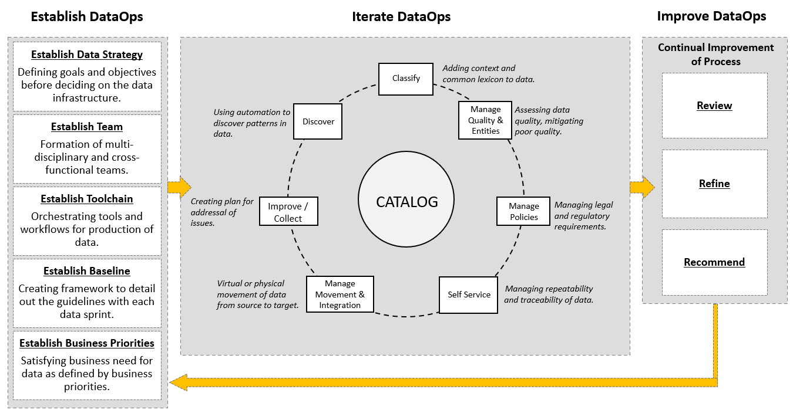

# Introdcution to Data Engineering

## Modern Data Ecosystem and Role of Data Engineering

The value we derive from data depends on:

- Accuracy of data
- Accessibility of data when we need it

A modern data ecosystem includes whole network of **interconnected**, **independent** and **continually evolving** entities.

It involves:

- Data integrated from disparate sources.
- Different types of analysis and skills to generate insights.
- Active stakeholders to collaborate and act on insights generated.
- Tools, applications and infrastructure to store, process and disseminate data as required.

**Data sources**:

- Structured
- Unstructured

When working with many data sources,

- The first step is to pull a copy of data from the original sources into a data repository. At this stage, we look at only
  - Acquiring the data we need
  - Working with data formats, sources and interfaces through which data can be pulled.
  - *Challenges*: reliability, security and integrity of the data.
- Once the data is in common place(Enterprice data repository)
  - Raw data needs to be organized, cleaned up, optimized for access
  - Conform to compliances and standards enforced in the organization.
  - *Challenges*: Data management, repositories that provide high availability, flexibiliy, accessibiliy and security.
- Finally, Business stakeholders, Applications, programmers, analysts, data science use cases all pulling the data from Enterprice data repository.
  - *Challenges*: Interfaces, APIs, Applications that can get this data to the end users in line with their specific needs.

**Emerging technologies** shaping the modern data ecosystem:

- Cloud technologies
- Machine Learning
- Big Data

### Key Players in the Data Ecosystem

**Data Professionals**

- Data Engineers
  - Develop and maintain data architectures
  - Make data available for business operations and analysis
  - Extract, integrate and organize data from disparate sources
  - Clean, transform and prepare data
  - Design, store and managed data in data repositories
  - Skills:
    - Good knowledge of programming
    - Sound knowledge of systems and technology architectures
    - In-depth understanding of relational databases and non-relational data stores
- Data Analysts
  - Translates data and numbers into plain language for organizations to make decisions.
  - Inspect and clean data for deriving insights
  - Identify correlations, find patterns and apply statistical methods to analyze and mine data.
  - Visualize data to interpret and present the findings of data analysis.
  - Skills:
    - Good knowledge of spreadsheets, writing queries and using statistical tools to create charts and dashboards
    - Programming skills
    - Strong analytical and story-telling skills
- Data Scientists
  - Analyze data for actionable insights
  - Create predictive models using ML and DL
  - Skills
    - Knowledge of Mathematics and Statistics
    - Understanding of programming languages, databases and building data models
    - Domain knowledge
- Business Analysts
  - Leverage the work of Data analysts and Data scientists to look at possible implications for their business and the actions they need to take or recommend.
- Business Intelligence Analysts
  - Do the same work as Business Analysts but focus on market forces and external influences that shape their business
  - Organize and monitor data on different business functions
  - Explore data to extract insight and actionables that improve business performance.
  
**Summary**

- Data Engineers convert raw data into usable data
- Data Analysts use this data to generate insights
- Data scientists use Data analytics and Data Engineering to predict the future using data from the past.
- Business analysts and Business Intelligence analysts use these insights and predictions to drive decisions that benefit and grow their business

### Data Engineering

The field of Data Engineering concerns itself with the mechanics for the flow and access of data

- Provides a robust and scalable structure to make quality data available for decision-making
- Includes the tools and technolgies involved in data manipulation
- Involves understanding the compexities of data and how it is leveraged for fact-finding and decision making

It involves:

- Collecting source data
  - Extracting, integrating and organizing data from disparate sources
  - It includes
    - Data acquistion from multiple sources
    - Data architecture for storing source data
- Processing data
  - Cleaning, transforming and preparing data to make it usable
  - For this we need:
    - Distributed systems for processing data
    - Pipelines for extracting, transforming and loading data into data repositoris
    - Solutions for safeguarding quality, privacy and security of data
    - Performance optimization
    - Adherence to compliance guidelines
- Storing data
  - Storing data for reliability and easy availablity of data
  - For this we need:
    - Data stores for storage of processed data
    - Scalable systems
    - Ensuring data privacy, security, compliance, monitoring, backup and recovery
- Making data available to users securely
  - APIs, sevices and programs for retrieving data for end-users
  - User access through interfaces and dashboards
  - Checks and balances to ensure data security

Data Engineering is a team sport:

- Architect: Architect data management systems for collecting and storing data
- Database experts: Optimize data stores for high availablity
- Proficiency in Data tools, programming languages and distributes dystems

## Responsibilties and Skillsets of a Data Engineer

At broad level, Data Engineers:

- Extract, organize and integrate data from disparate sources
- Prepare data for analysis and reporting by transforming and cleansing it
- Design and manage data pipelines that encompass the journey of data from source to destination systems
- Setup and manage the infrastructure(Data platforms, Data stores, Distributed systems, Data repositories) required for ingestion, processing and storage of data

**Technical Skills**:

- Operating Systems
  - Unix, Linux, Windows Administrative Tools, System Utilities & Commands
- Infrastructure Components
  - Virtual Machines, Networking, Application Services(Load balancing, application performance monitoring), Cloud-based services
- Databases and Data Warehouses
  - RDBMS such as IBM DB2, MySQL, Oracle Database, PostgreSQL
  - NoSQL such as Redis, MongoDB, Cassandra, Neo4J
  - Data Warehouses such as Oracle Exadata, IMB Db2 Warehouse on Cloud, IBM Netezza Performance Server, Amazon Redshift
- Data Pipelines
  - Apache Beam, Airflow, DataFlow
- ETL Tools
  - IBM Infosphere Information Server, AWS Glue and Improvado
- Language
  - Query languages
    - SQL for relational databases and SQL-like query languages for NoSQL databases
  - Programming languages
    - Python, R, Java
  - Shell and Scripting languages
    - Unix/Linux Shell and PowerShell
- Big Data Processing Tools
  - Hadoop, Hive, Spark

**Functional Skills**:

Data Engineering is at the intersection fo Software Engineering and Data Science.

- Ability to convert business requirements into technical specifications.
- Ability to work with complete software development lifecycle which includes Ideation -> Architecture -> Design -> Prototyping -> Testing -> Deployment -> Monitoring
- Understand data's potential application in business
- Understand the risks of poor data management. Covers Data Quality, Data Privacy, Security and Compliance

**Soft Skills**:

Will be working with other roles such as Technical teams, Business users, Analysts, Data Scientists. So, following skill are necessary

- Interpersonal Skills
- Teamwork
- Collaboration
- Effective communication

## Data Engineering Ecosystem

A Data Engineer's ecosystem includes the infrastructure, tools, framkeworks and processes for:

- Extracting data from disparate sources
- Architecting and managing data pipelines for transformation, integration and storage of data
- Architecting and managing data repositories
- Automating and optimizing workflows and flow of data between systems
- Developing applications needed through the data engineering workflow

**Data**:

- Structured
  - Data that follows a rigid format and can be organized into rows and columns.
  - eg: relational databases, spreadsheet
- Semi-structured
  - Mix of data that has consistent characteristics and data that does not conform to a rigid structure
  - eg: Email, Json
- Unstructured
  - Data that is complex and mostly qualitative information that cannot be structured into rows and columns.
  - eg: photo, videos, text file, social media contents

**Data Repositories**:

- Transactional or Online Transaction Processing(OLTP) System
  - Designed to store high volume day-to-day operational data
  - eg: online banking transactions, ATM transactions etc
  - Typically relational, but can also be non-relational
- Analytical or Online Analytical Processing(OLAP) System
  - Optimized for conducting complex data analytics
  - Include reltional and non-relational databases, data warehouses, data marts, data lakes and big data stores.

**Data Integration**:

Collated --> Processed --> Cleansed --> Integrated --> Users

**Data Pipeline**:

A set of tools and processes that cover the entire journey of data from source to destination systems.

**Languages**:

- Query languages
  - For querying and manipulating data
  - eg: SQL
- Programming languages
  - For developing data applications and controlling application behaviour
  - eg: Python, R, Java
- Shell and Scripting languages
  - For repetitive and time-consuming operational tasks
  - eg: Unix/Linux Shell, PowerShell

**BI and reporting Tools**:

- Collect data from multiple data sources and present them in a visual format, such as interactive dashboards.
- Visualize data in real-time and pre-defined schedule

**File formats**:

- Delimited text file formats eg: CSV, TSV
- Microsoft Excel Open .XML spredsheet, or .XLSX
- Extensible Markup Language, or .XML
- Portable Document Format, or. PDF
- JavaScript Object Notation, or .JSON

**Data Sources**:

- Relational Databases
- Flat File and XML datasets
- APIs and Web Services
- Web Scraping
  - Popular web scraping tools: BeautifulSoup, Scrapy, Pandas, Selenium
- Data Streams and Feeds
  - Popular technologies used to process data streams include: Kafka, Apache Spark and Apache Storm
  - RSS(Really Simple Syndication) Feeds: capturing data from online forums and news sites where data is refreshed on an ongoing basis.

**Meta Data**:

Metadata is data that provides information about other data.

Three main types of metadata:

- Technical metadata
  - Defines the data structures in data repositories or platforms, primarily from a technical perspective.
  - eg:
    - Tables that record information about the tables stored in a database
    - A data catalog, which is an inventory of tables that contain information
  - For relational databases, technical metadata is typically stored in specialized tables in the database called the *System Catalog*.
- Process metadata
  - Describes the processes that operate behind business systems such as data warehouses, accounting systems, or customer relationship management tools.
  - Tracking things like:
    - process start and end times
    - disk usage
    - where data was moved from and to
    - how many users access the system at any given time
  - Invaluable for troubleshooting and optimizing workflows and ad hoc queries.
- Business metadata
  - Information about the data described in readily interpretable ways, such as:
    - how the data is acquired
    - what the data is measuring or describing
    - the connection between the data and other data sources
  - Useful for users who want to explore and analyze data. Help them to find data which is meaningful and valuable and know where the data can be accessed from.

Metadata management:

- Creation of a reliable, user-friendly data catalog is the primary objective of a metadata management model.
- A modern metadata managment model will include a web-based user interface that enables users to easily search for and find information on key attributes such as CustomerName or ProductType.
- This kind of model is central to any Data Governance initiative.
- Well managed metadata helps to understand both the business context associated with the enterprise data and the data lineage, which helps to improve data governance.
- **Data lineage** provides information about the origin of the data and how it gets transformed and moved, and thus it facilitates tracing of data errors back to their root cause.
- The key focus areas of **data governance**:
  - include
    - availability
    - usability
    - consistency
    - data integrity
    - data security
  - includes establishing processes to ensure effective data management throughout the enterprise such as accountability for the adverse effects of poor data quality and ensuring that the data which an enterprise has can be used by the entire organization.
- Popular metadata management tools:
  - IBM InfoSphere Information Server
  - CA Erwin Data Modeler
  - Oracle Warehouse Builder
  - SAS Data Integration Server
  - Talend Data Fabric
  - Alation Data Catalog
  - SAP Information Steward
  - Microsoft Azure Data Catalog
  - IBM Watson Knowledge Catalog
  - Oracle Enterprise Metadata Management (OEMM)
  - Adaptive Metadata Manager
  - Unifi Data Catalog
  - data.world
  - Informatica Enterprise Data Catalog

### Data Repositories

Data repositry is a general term used to refer to data that has been collected, organized and isolated for using in business operations as well as business and data analysis.

Types:

- Databases
  - Collection of data for input, storage, search, retrieval and modification of data.
  - DBMS is a set of programs for creating and maintaining the database. Allows to store, modify and extract info from database using queriesd.
  - Types of databases:
    - Relational
    - Non-relational
- Data Warehouses
  - Consolidates data through the ETL process into one comprehensive database for analytics and business intelligence.
- Big Data Stores
  - Distributed computational and storage infrastructure to store, scale and process very large datasets.
  
#### RDBMS

- Collection of data organized into a table structure where the tables can be linked or related based on data common to each.
- Ideal for the optimized storage, retrieval and processing of large volumes of data.
- Relational databases can be:
  - Open-source with internal support
  - Open-source with commercial support
  - Commercial closed-source
  - eg: IBM DB2, MS SQL Server, MySQL, Oracle Database, PostgresSQL
  - Cloud based relational database services
    - eg: Amazon RDS, Google Cloud SQL, IBM DB2 on Cloud, Oracle Cloud, Azure SQL
- Advantages
  - Create meaningful information by joining tables
  - Flexibility to make changes while the database is in use
  - Minimize data redundancy
  - Ease of backup and disaster recovery by offering export and import options.
  - ACID compliant, ensuring accuracy and reliability in database transactions.
- Use cases
  - OLTP
  - Datawarehouse(OLAP)
  - IoT Solutions
- Limitations
  - Does not work well with semi-structured and unstructured data.
  - Entering a value greater than the defined length of a data field results in loss of information

#### NoSQL

- Provides flexibile schemas for the storage and retrieval of data.
- Chosen for their attributes arond scale, performance and ease of use.
- Built for specific data models
- Has flexibile schemas that allow programmers to create and manage modern applications.
- Do not use a traditional row/column/table database desing with fixed schemas.
- Can store structured, semi-structure and unstructured data.
- Based on model being used for storing data, four common types of NoSQL databases:
  - Key-value store
    - Storing data as collection of key-value pairs.
    - **Key**: attribute of data that is a unique identifier.
    - eg: Redis, Memcached, DynamoDB
    - Usecases: user session data, user preferences, real-time recommendations, targeted advertising, in-memory data caching.
  - Document based
    - Store each record and it associated data within a single document.
    - Enable flexibile indexing, powerful adhoc queried and analytics over collection of documents.
    - Usecases: eCommerce platforms, medical records storage, CRM platforms and analytics platforms.
    - eg: MongoDB, DocumentDB, CouchDB, Cloudant
  - Column based
    - Data is stored in cells grouped as columns of data instead of rows.
    - A logical grouping of columns is referred to as a column family.
    - As all cells corresponding to a column are saved as a continuous disk entry, making access and search easier and faster.
    - Use cases: systes that required heavy write requests, storing time-series data, weather data and IoT data.
    - Not good for: running complex queries, change quering pattern frequently.
    - eg: Cassandra, HBase
  - Graph based
    - Use a graphical model to represent and store data.
    - Use for visualizing, analyzing and finding connections between different pieces of data.
    - Good for: social networks, product recommendations, network diagrams, fraud detection, access management.
    - Not god for processing high volumes of transactions
    - eg: Neo4J, CosmosDB

#### Data Warehouses, Data Marts and Data Lakes

**Data Warehouses**:

- Used for storing modelled, structured, analysis ready data
- Has a 3-tier architecture
  - Database Servers(extracting data from different sources)
  - OLAP Server(process and analyze information coming from database servers)
  - Client-Front end layer for quering, reporting and analyzing data
- Benefits of cloud-based data warehouses:
  - Lower costs
  - Limitless storage and compute capabilities
  - Scale on a pay-as-you-go basis
  - Faster disaster recovery
  - eg: teradata, Oracle Exadata, IBM Db2, Netezza, Amazon Redshift, Google BigQuery, Cloudera, Snowflake
  
**Data Marts**:

- Sub-section of the data warehouse.
- Build specifically for a particular business function, purpose or community of users.
- Three types:
  - Dependent
    - Offer analytical capabilities for a restricted area of a Data Warehouse.
    - Provides isolated security and performance
  - Independent
    - Created from sources other than an Enterprise Data Warehouse such as Internal Operational Systems or External Data.
  - Hybrid
    - Combine inputs from Data Warehouses, Operational Systems and External Systems.
- Purpose:
  - Provide relavant data to users on time.
  - Accelerate business processes
  - Provide a cost and time efficient way in which data driven decisions can be taken.
  - Improve end-user response time
  - Provide secure access and control

**Data Lakes**:

- Store large amounts of structured, semi-structured and unstructured data in their native format.
- Data can be loaded without pre-defined structure and schema
- Exists as a repository of raw data straight from the source, to be transformed based on the use case.
- Data is classified, protected and governed.
- A reference architecture that combines multiple technologies.
- Can eb deployed using
  - Cloud Object Storage eg: Amazon S3
  - Large-scale distributed systems such as Apache Hadoop
  - RDBMS or NoSQL data repositories
- Benefits:
  - Ability to store all types of data(unstructured, semi-structured and structured data)
  - Agility to scale based on storage capacity
  - Saving time in defining structures, schemes and transformations as data is imported in original format.
  - Ability to repurpose data in several different ways and use cases.
  - Vendors providing data lakes: Amazon, cloudera, Google, IBM, Informatica, Microsoft, Oracle, SAS, Snowflake, Teradata.

**A data swamp**:

- is a data lake containing duplicate, inaccurate and incomplete data.
- Usually the result of a lack of processes and standards. 
- Data in a data swamp is difficult to find, manipulate, and—inevitably—analyze.

**Data Lakehouse**:

- Combine the best of data lake and data warehouse.
- We get flexibility and cost effectiveness of data lake.
- We get the performance and structure of data warehouse.
- From a value point of view, the lakehouse provides us with a cost-effective means of storing data from a rapidly increasing array of new sources. It also utilizes built-in data management and governance layers to enable swift execution of business intelligence and high-performance machine learning tasks.

#### Considerations for choosing Data Repository

- Types of data: structured, semi-structured or unstructured.
- Data schema
- Peformance requirements
- Data at rest or streaming data
- Encryption needs
- Volume of data
- Storage requirements
- Frequency of data access
  - Frequent updates
  - Keep for long time
- Type of access
  - At short intervals
  - Run long-running queries
- Purpose
  - Transactional
  - Analytical
  - Archival
  - Data warehousing
- Compatibility of the data repository with Existing ecosystem of
  - Organization standards
  - programming languages
  - Tools and Processes
- Security features of the data repository
- Scalability from a long-term perspective
- Consideration of existing skills and want to foster
- Cost

#### ETL, ELT and Data Pipelines

**ETL**(Extract, Transform and Load) process is an automated process which includes:

- Gather raw data differnt sources
- Extract information needed for reporting/analysis
- Clean, standardize and transform data into usable format
- Load/transport processed data into a data repository

Extraction can be through:

- Batch processing. Example tools: Blendo, Stitch
- Stream processing. Example tools: Apache Samza, Apache Storm and Apache Kafka

Transforming data:

- eg:
  - standardize date formats and units of measurement
  - Removing duplicate data
  - Filtering out data ths is not required
  - Enrich data
  - Form key relationship across tables
  
Loading:

- Initial loading: populate all the data in the repository.
- Incremental loading: apply updates and modifications periodically.
- Full refresh: eracing and reloading with fresh data

Load verification: checks for

- Missing or null values
- Server performance
- Load failures

Popular ETL tools:

- IBM Infosphere Information Server
- AWS Glue
- Improvado
- Skyvia
- HEVO
- Informatica PowerCenter

In the **ELT**(Extract, Load and Transform) process:

- Extracted data is first load into the target system and transformation are getting applied after in the target system.
- The destination system for an ELT pipeline mostly a data lake or a data warehouse.
- Ideal for Data Lakes
- Advantages:
  - Helps processing large sets of unstructured and non-relational data.
  - By delivering raw data directly to the destination system instead of staging, we can reduce the cycle time between extraction and delivery.
  - Allows to ingest the large volume of data immediately as they become available.
  - Provide greater flexibility for exploratator data analytics.
  - Tranform only data which is required for analysis. So, can be leveraged for multiple use cases.
  - More suited for Big Data.

**Data Pipeline**:

- Encomposses the entire journey of moving data from one system to another including the ETL process.
- Can be used for both batch and streaming data.
- Destinations can be data lake, data warehoues, applications and visualization tools.
- eg for data pipeline solutions:  Apache Beam, Airflow and Data Flow

#### Data Integration

> Data Integration is a descipline comprising the practices, architectural techniques and tools that allow organizations to ingest, transform, combine and provision data across various data types.
-- Gardner report - Magic Quadrant for Data Integration

Includes

- Access/query/extract data from operations systems.
- Transform/merge extracted data logically/physically.
- Data quality and governence
- Deliver data through an integrated approach for analytics purposes.

Data Integration Usage schenarios:

- Data consistency across applications
- Master data management
- Data sharing between enterprises
- Data migration and consolidation

Data Integration vs Data Pipeline

- Data Integration Platforms combine disparate sources of data, physically or logically, to provide a unified view of the data for analytics purposes.
- Data pipeline convers the entire journey of data from source to destination systems.
- Can use Data pipeline to perform data integration.
- ETL is the process within the data integration.

Capabilities fo Moden data integrtion platform:

- Pre-built connectors and adapters
- Open-source architecture
- Optimization for both batch and stream processing of data.
- Integration with Big data sources.
- Additional functionalities for data quality, governance, compliance and security.
- Portability between on-premise and different type of cloud environments.

Data Integration tools:

- IBM Inforsphere Information Server
- Cloud Pak for Data
- Cloud Pak for Integration
- IBM Data Replication
- IBM Data Virtualization Manager
- IBM Infosphere Information Server on Cloud.
- IBM InforSphere DataStage
- Open source tools examples:
  - boomi
  - Jitterbit
  - snampLogic
- Cloud-based integration Plantform as a Service(iPaaS):
  - Adeptia Integration Suite
  - Google Cloud's Cooperation 534
  - IBM's Application Integration Suite on Cloud
  - Informatica's Integration Cloud

#### Commonly used tools, Databases, Data repositoris

- RDBMS databases:
  - MySQL
  - MariaDB
  - PostgreSQL
  - IBM Db2
  - MS SQL Server
- NoSQL databases:
  - MongoDB
  - Cassandra
- Graph databases:
  - Neo4J
- Languages
  - Python
- Data Pipeline
  - Apache Airflow
- Data Integration
  - Okada
- Bigdata Systems
  - Hadoop
  - Spark
- Streaming data
  - Kafka
  - WebSphere MQ
- ETL
  - Talend
- Web scraping
  - Beautiful Soup
  - Scrappy
- Data Warehouse
  - AWS Redshift
- Data Lake
  - AWS S3
- Data migration tools
  - SSIS
  - Apache Nifi
- Version Control
  - Git
- Devops
  - Jenkins
  - Docker
  - Sonarqube

### Big Data Platforms

#### Foundations

**V's of Big Data**:

- Velocity
- Volume
- Variety
- Veracity
- Value

#### Big Data processing tools

Provide ways to work with large sets of structured, semi-structured and unstructured data to derive value from them.

**Apache Hadoop**:

- A collection of tools that provides distributed storage and processing of data.
- A collection of node(a single computer) form a cluster.
- Provides reliable, scalable and cost-effective solution for storing data with no format requirements.
- Benefits:
  - Better real-time data-driven decitions
  - Improved data access and analysis
  - Data offload and consolidation
- Components:
  - HDFS(Hadoop Distributed File System)
    - Higher availability
    - Better scalability
    - Data locality
    - Faut tolerance

**Apache Hive**:

- A data warehouse for data query and analysis built on top of hadoop.
- Enables reading, writing and managing large data set files that are stored directly in either HDFS or other data storage systems such as Apache HBase.
- Queries have high latency -> Not suitable for applications that need fast response times.
- Read-based -> Not suitable for transaction processing that involves a high percentage of write operations.
- Better suited for -> ETL, reporting and data analytics.

**Apache Spark**:

- A distributed analytics framework for complex, real-time data analytics.
- Takes the advantage of in-memory processing which significantly increases computation speed.
- Provide interfaces to major programming languages such as Java, Scala, Python etc.
- Can run using a standalone clustering technology and also can run on top of other infrastructures like Hadoop.
- Can access data in a large variety of data sources including HDFS and Hive.

## Data Engineering Lifecycle

### Data platforms, stores and Security

#### Data Platform Architecture

**Layers of Data Platform Architecture**:

1. Data Ingestion or Data Collection Layer
   - Connect to data sources
   - Transfer data from data sources to the data platform in streaming or batch modes.
   - Maintain information about the data collected in the *metadata repository*
   - Tools for Data Ingestion
     - Googe Cloud Data Flow
     - IBM Streams
     - IBM Streaming Analytics on Cloud
     - Amazon Kinesis
     - Apache Kafka
2. Data Storage and Integration Layer
   - Store data for processing and long-term use
   - Transform and merge extracted data, either logicall or physically
   - Make data available for processing in both streaming and batch modes
   - It has to be
     - Reliable
     - Scalable
     - High-performing
     - Cost efficient
   - Examples
     - IBM Db2
     - MS SQL Server
     - MySQL
     - Oracle Database
     - PostgreSQL
   - Cloud databases(Database-as-a-Service):
     - IBM Db2 on Cloud
     - Amazon RDS
     - Google Cloud SQL
     - SQL Azure
   - Non_relational Database:
     - IBM Cloudant
     - Redis
     - MongoDB
     - Cassandra
     - Neo4J
   - Integration Tools:
     - IBM's Cloud Pak for Data
     - IBM's Cloud Pak for Integration
     - Talend Data Frabric
     - OpenStudiota
   - Open-source Integration tools:
     - Dell boomi
     - SnapLogic
   - Cloudbased Platform as a Service(iPaaS)
     - Adeptia Integration Suite
     - Google Cloud's Cooperation 534
     - IBM's Application Integration Suite on Cloud
     - Informatica's Integration Cloud
3. Data Processing Layer
   - Read data in batch or streaming modes
   - Support popular quering tools and programming languages
   - Scale to meet the processing demands of a growing dataset 
   - Provide a way for analysts and data scientists to work with data in data platform.
   - Transformation tasks:
     - *Structuring* - actions that change the data form/schema
     - *Normalization* - cleaning the database of unused data and reducing redunancy and inconsistency
     - *Denormalization* - combining data from multiple tables into a single table so that it can be queried more efficiently.
     - *Data Cleaning* - Fixing irregularities in data to provide credible data for downstream applications and uses.
     - Tools
       - Spreadsheets
       - OpenRefine
       - Google DataPrep
       - Watson Studio Refinery
       - Trifacta Wrangler
       - Python/R Libraries
     - Storage and processing may not always in seperate layers
       - In case of Relational Databases, storage and processing can be in samel layer
       - In Big Data Systems, data can be stored in HDFS and then can be processed with tools like Spark.
4. Analysis & User Interface Layer
   - Deliver processed data to data consumers(BI Analysts, Business stakeholders, Data scientists/Analyists. Other Applications & Services).
   - Need to support 
     - Querying tools and programming languages
     - APIs that can be used to run reports on data for both online and offline processing.
     - APIs that can consume data from the storage in real-time for use in other applications and services.
     - Dashboaring and Business Intelligence applications.
5. Data Piepline layer
   - Reponsible for implementing and maintaining a continuosly flowing data pipeline.
   - Toosl
     - Apache Airflow
     - Data Flow

**Designing Data Stores**:

A data repository can be:

- Database
- Data Warehouse
- Data Mart
- Big Data Store
- Data Lake

Considerations for designing a data store:

- Type of data
  - Relational databases for structured data
  - Non-relational databases for semi/unstructured data
    - Key-value
    - Document based
    - Column based
    - Graph based
- Volume/scale of data
  - To store large volumes of data in its native format, a data lake would be a good choice
  - Big data store for not only high volume but also for high velocity, deverse types and for distributed processing for fast analytics.
- Intended use of data
  - Number of transactions
  - Frequency of updates
  - Types of operations
  - Response time
  - Backup and recovery
- Storage considerations
  - Performance: Throughput and Latency
  - Availability: able to ccess data when required
  - Integrity: safe from corruption, loss and outside attack
  - Recoverability:  able to revover data in the event of failures and natural disasters.
- Privacy, Security and Governance needs
  - Is a layerd approach
  - Includes: Access control, Multizone Encryption, Data management and monitoring systems.
  - Comply with regularions such as GDPR and HIPA.
  - Data needs to be made available through controlled data flow and data management by using multiple data protection techniques.
  - Strategies for data privacy, security and governance regulations

**Security**:

Data platforms security level:

- Physical
- Network
- Application and Data

Key components to create an effective strategy for information secrutiy, CIA Triad:

- *Confidentiality*: through cotntrolling unauthoized access.
- *Integrity*: through validating the resources are trustworthy and not been tampared with.
- *Availability*: by ensuring authorized users have access to resources when required.

### Data Collection and Data Wrangling

**Data Collection**:

- Query languages
  - SQL is a querying language used for extracting information from relational databases.
  - Non relational databases can be queried using SQL or SQL like query languages.
- APIs
  - Can be used for extracting data from variety of data sources.
  - Can also be used for data validation
- Extract data from web
  - Web srapping
  - RSS feeds
- Data streams and feeds are also used for extracting data from social media sites and interactive platforms.
- Data Exchange platforms
  - allow the data exchange between data providers and data consumers.
  - eg: AWS DataExchange, Crunhbase, Lotame, Snowflake

**Data Wrangling**:

- Is an iterative process involves
  - Data exploration
  - Transformation
    - Involves actions that change the form and schema of data
    - Joins and Unions
    - Normalization and Denormalization of data
    - Cleaning
  - Validation
  - Making data available for credible and meaningful analysis
- Tools
  - Excel Power Query / Spreadsheets
  - OpenRefine
  - Google DataPrep
  - Watson Studio Refinery
  - Trifacta Wrangler
  - Python
  - R

### Querying Data, Performance Tuning and Troubleshooting

**Quering and Analyzing data**:

- Counting and Aggregating
- Identifying extreme values
- Slicing data
- Sorting data
- Filtering Patterns
- Grouping data
- Data can also be queried using APIs

**Peformance Tuning and Troubleshooting**:

- A data pipeline typically runs with a combination of complex tools and can face several different types of performance threats include
  - Scalability in the face of increasing data sets and workloads
  - Application failures
  - Scheduled jobs not functioning accurately
  - Tool incompatibilities
- Data pipeline - Performance metrics
  - Latency: the time for a service to fufill a request.
  - Failures: the rate at which a service fails
  - Resource utilization and utilization patterns
  - Traffic: number of user requests received in a given period
- Data pipeline - Troubleshooting
  - Collect informtion about the incident to ascertain if observed behavior is an issue.
  - Check if using right version of software and source codes.
  - Check the logs and metrics.
  - Reproduce the issue in a test env.
- Database optimization for performance
  - Peformance metrics for databse:
    - System outages
    - Capacity utilization
    - Application slowdown
    - Peformance of queries
    - Conflicting actitivities and queries being executed simultaneously
    - Batch activities causing resource constraints
  - Cpacity planning - Determine the optimal hardware and software resources required for perfomance
  - Database Indexing - Locating data without searching each row in a database resulting in faster quering.
  - Database partitioning - Divide large tables into smaller to improve performance and data manageability.
  - Database normalization - Reducing inconsistencies, redunancy and anomoalies.
- Monitoring systems
  - Helps to collect quantitative data about systems and application in real time.
  - Visibilty into the peformance of data pipelines, platforms, databases, applications, tools, queries, scheduled jobs etc.

### Governance and Compliance

Data Governance is a collection of principles, practices and processes to maintain the:

- Security
- Privacy
- Integrity

through its lifecycle.

Regulations

- GDPR
- HIPAA

Compliance: coveres the processes and procedures through which an organization adheres to regulations and conducts its operations in a legal and ethical manner.

Tools and technologies play a critical role in the implementation of a governance framework, offering features such as:

- Authentication and Access Control.
- Encryption and Data Masking.
- Hosting options that comply with requirements and restrictions for international data transfers
- Monitoring and Alerting functionalities.
- Data erasure tools that ensure deleted data cannot be retrieved.

### DataOps Methodology

